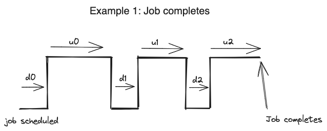
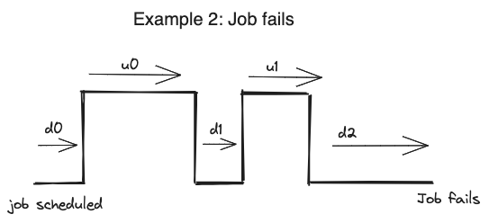

# MegaMon

MegaMon provides metrics related to running JobSets on top of Kubernetes.

MegaMon provides metrics at the container and node levels.

MegaMon provides granular metrics about when a JobSet is Up. This allows for calculations such as MTBI (Mean Time Between Interruption).

MegaMon provides granular merics about when a JobSet is Down. This allows for calculations such as MTTR (Mean Time To Recovery).

| Metric                            | Megamon Name                                                                  | Calculation      |
|-----------------------------------|-------------------------------------------------------------------------------|------------------|
| Jobset Up time                    | jobset_up_time_seconds_total                                                  | u0 + u1 + u2     |
| Jobset Interruption time          | jobset_down_time_between_recovery_seconds                                     | d1 + d2          |
| Down time                         | jobset_down_time_seconds                                                      | d0 + d1 + d2     |
| Time between/around interruptions | Jobset_up_time_between_interruption_seconds                                   | u0 + u1          |
| Interruption count                | jobset_interruption_count_total                                               | count(d1,d2) = 2 |
| Provisioning time                 | jobset_down_time_intital_seconds                                              | d0               |
| Recovery time                     | jobset_recovery_time_seconds                                                  | d1 + d2          |
| Recovery count                    | jobset_recovery_count_total                                                   | count(u1,u2) = 2 |
| Jobset MTTR                       | jobset_down_time_between_recovery_seconds / jobset_recovery_count_total       | (d1 + d2) / 2    |
| Jobset MTBI                       | Jobset_up_time_between_interruption_seconds / jobset_interruption_count_total | (u0 + u1) / 2    |

| Metric                            | Megamon Name                                                                  | Calculation   |
|-----------------------------------|-------------------------------------------------------------------------------|---------------|
| Jobset Up time                    | jobset_up_time_seconds_total                                                  | u0 + u1       |
| Jobset Interruption time          | jobset_down_time_between_recovery_seconds                                     | d1 + d2       |
| Down time                         | jobset_down_time_seconds                                                      | d0 + d1 + d2  |
| Time between/around interruptions | Jobset_up_time_between_interruption_seconds                                   | u0 + u1       |
| Interruption count                | jobset_interruption_count_total                                               | count(d1) = 1 |
| Provisioning time                 | jobset_down_time_intital_seconds                                              | d0            |
| Recovery time                     | jobset_recovery_time_seconds                                                  | d1            |
| Recovery count                    | jobset_recovery_count_total                                                   | count(u1) = 2 |
| Jobset MTTR                       | jobset_down_time_between_recovery_seconds / jobset_recovery_count_total       | d1 / 1        |
| Jobset MTBI                       | Jobset_up_time_between_interruption_seconds / jobset_interruption_count_total | (u0 + u1) / 2 |

## TODO

* Make sure to always emit the final summaries for a completed/failed jobset.
* Account for jobset UIDs.

## Why MegaMon over Kube State Metrics

MegaMon was created to address shortcoming of using [kube-state-metrics](https://github.com/kubernetes/kube-state-metrics):

* Lack of ability to stop publishing a metric the moment a JobSet completes/fails.
* Difficult/impossible to aggregate metrics across all JobSets if time-line of metrics is not well defined.
* Complexity in querying Node metrics (Node labels are a separate metric)
* Difficult to derive high level metrics (like MTTR) when baseline metrics like Up-ness of jobset containers / nodes require their own complex queries.
* Difficult or impossible to derive metrics like Time-to-provisioning / Time-to-first-up with promql
* Current metrics are very large (they require all Nodes to be published as individual metrics and aggregated later)
